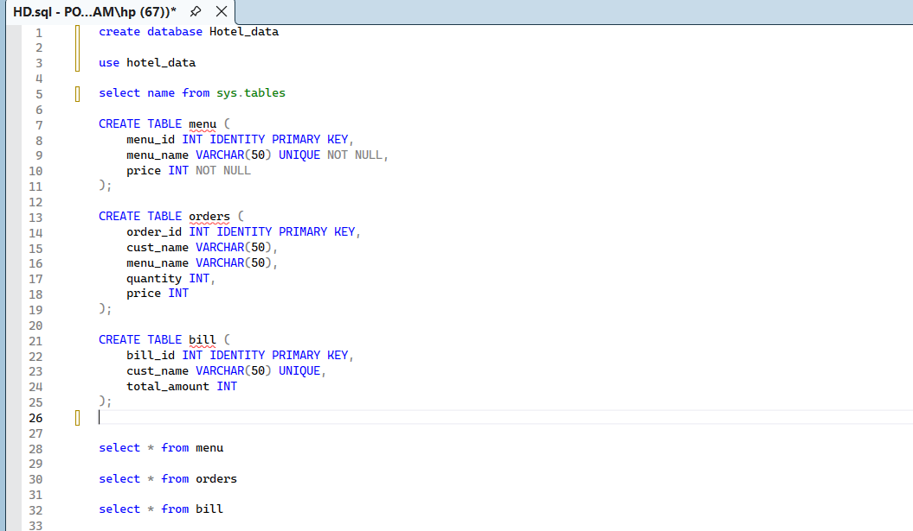

## **Python Assignment + Project**

#### This repository contains python assignment questions file ( Assignment-Questions.py and List-Comprehsion-lambda.py ) and python project file ( Print-Bill-Project.py ).

## **Project Introduction :**

This project is a HMS (customer Bill Printing + add new menu with price ) developed using Python and SQL Server. It allows hotel staff to manage menu items, take customer orders, and generate bills efficiently. The system uses Object-Oriented Programming (OOP) concepts (Class, Inheritance) and connects to a database using pyodbc for data storage.

This project helps automate hotel billing operations and reduces manual errors.

## **Project Functionality :**

This Project allows users to manage hotel menus, take customer orders,Print Bills and store order details in a database.
The system automatically calculates bills and enables printing customer-wise bills from stored data.
It uses object-oriented programming with database connectivity for real-time data handling.

following are the functionality of Hotel staff and customer

1. Show Menu
    This function is used to show all menu/items available in database with price 
2. Add New Menu
3. Take Order
4. print Bill
5. Exit

## Input-Output Screens

1) Database Schema :

